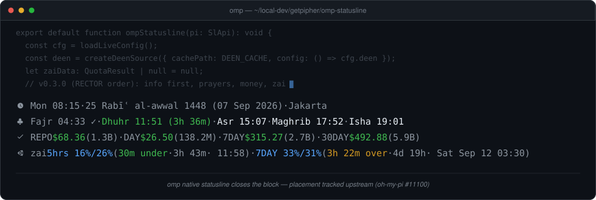
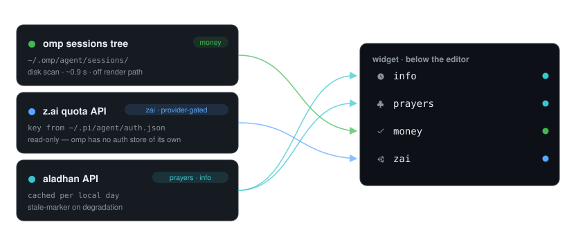

# omp-statusline

> Four lines under your editor — Hijri clock, prayer times, API-spend ledger, and z.ai quota pace — styled to match omp's native chrome.

[](https://www.npmjs.com/package/@getpipher/omp-statusline)
[](https://github.com/getpipher/omp-statusline/actions/workflows/ci.yml)
[](https://github.com/can1357/oh-my-pi)
[](./package.json)
[](./LICENSE)



A statusline widget for [omp](https://github.com/can1357/oh-my-pi) (Oh My Pi) — the omp-native successor to [pi-statusline](https://github.com/getpipher/pi-statusline). It renders below the editor in omp's own visual language (` · ` separators, nerd glyphs, theme tokens), and omp's native statusline closes the block beneath it (extension widgets cannot render under it yet — tracked upstream as [can1357/oh-my-pi#11100](https://github.com/can1357/oh-my-pi/issues/11100)).

## What it renders

Render order (top → bottom): **info · prayers · money · zai**.

| Line | Contents |
|---|---|
| **info** | Local weekday + clock — `Wed 21:12` · Hijri date with Gregorian gloss — `27 Rabīʿ al-awwal 1448 (09 Sep 2026)` · city — all dim. |
| **prayers** | All five prayers with wall times, from [aladhan](https://api.aladhan.com) (cached per local day, stale-marker on degradation). Past prayers get a dim `✓`; the next prayer is green with a countdown on its segment only — `Dhuhr 11:51 (3h 36m)`. |
| **money** | API spend + token volume per window: `REPO $68.36 (1.3B)` (all-time for the current project) · `DAY` (since 00:00 local) · `7DAY` / `30DAY` (rolling, hour-aligned). Token volumes are dim, from the same sessions scan. |
| **zai** | Quota pace per window: `LABEL usage%/elapsed% (pace · reset · absolute)` — e.g. `5hrs 16%/26% (30m under · 3h 43m · 11:58)`. **Provider-gated**: renders only while the active model's provider is `zai` (or the provider is unreadable); vanishes entirely on other providers. |

**Pace** — `window × (usage% − elapsed%)/100` — renders `1h 36m over` (orange: burning faster than the clock, quota exhausts early by that much) or `1d 5h under` (green: behind the clock). Percent heat: accent < 70%, warning ≥ 70%, error ≥ 90% — raw, so over-quota stays error-red while display caps at `100%+`.

## The money line is a ledger, not a tracker



Costs are disk-scanned from omp's own session tree (`~/.omp/agent/sessions/`), not tracked live:

- every session file embeds its `cwd` and per-assistant-message `usage.cost.total` — the tree is a complete ledger;
- **subagent spend is included**: subagent transcripts persist as session-format JSONL artifacts (`<repo-slug>/<session-id>/<Agent>.jsonl`) and are scanned too;
- entry ids are deduped globally, so branched/resumed session copies never double-count;
- the sessions tree (including history migrated from pi) supersedes the retired pi-statusline ledger.

The full rescan runs off the render path (~0.9 s over ~52 k entries) on the poll cycle; renders between polls use the cached snapshot. Countdowns (prayer, quota reset) still move — the widget re-renders every 30 s without touching the network or disk.

## Install

```
omp plugin install @getpipher/omp-statusline
```

Or from a checkout: `omp plugin link /path/to/omp-statusline`.

## Config

`~/.omp/agent/omp-statusline/config.json` — every key optional:

```json
{
  "zai": {
    "pollIntervalMs": 180000
  },
  "deen": {
    "city": "Jakarta",
    "country": "Indonesia",
    "method": "auto",
    "escalateMinutes": 30
  }
}
```

| Key | Default | Notes |
|---|---|---|
| `zai.pollIntervalMs` | `180000` | Poll cycle for quota fetch + money rescan (clamped to ≥ `30000`). |
| `zai.authJsonPath` | *unset* | Explicit pi-style auth JSON `{"zai": {"key": "…"}}`, read-only — pins that file as the sole key source. Unset (default): the key resolves from **omp's own credential store** (`omp /login` → `models.yml` → env → auth broker) via the host, falling back to `~/.pi/agent/auth.json` — omp-only setups need no pi files. |
| `deen.city` / `deen.country` | `Jakarta` / `Indonesia` | aladhan lookup. |
| `deen.method` | `auto` | Calculation method (`auto` → aladhan default). |
| `deen.escalateMinutes` | `30` | Minutes-until-next-prayer threshold for the `soon` escalation band. |

State (deen cache) lives beside the config in `~/.omp/agent/omp-statusline/`.

## `/sl` — force refresh & full report

Forces a zai + deen + money refresh and notifies full source state: quota freshness, today's plan credits, 7-day per-model split, usage streaks, cache-hit rate, prayer city/hijri, and the spend breakdown including subagent share and entry count:

```
zai key omp credentials · 5h 16% · weekly 24% · fetched 0m ago · today 7.7K · models 7d glm-5.3 28K · gpt-5.4 9.2K · streak 46d (best 61d) · cache 71% | deen Jakarta · 25 Rabīʿ al-awwal 1448 (07 Sep 2026) · fresh | money REPO $68.36 · DAY $26.50 · 7DAY $315.27 · 30DAY $492.88 · sub $11.02 · 1234 entries
```

The z.ai dashboard endpoints (`credit-usage/usage-detail`, `credit-usage/activity`) accept the same API key as the quota API — no browser or cookie session needed.

## Provenance

Data layer (`src/quota/`, `src/deen/`, `src/adapters/`, `src/format.ts`, `src/types.ts`) vendored verbatim from [`@getpipher/pi-statusline`](https://github.com/getpipher/pi-statusline) (same author, MIT) — see [`NOTICE`](./NOTICE). MIT licensed.
